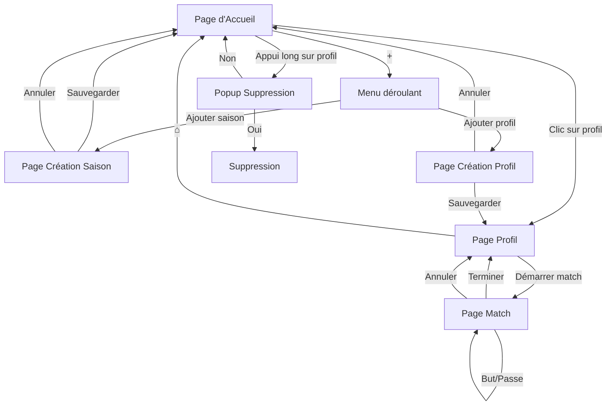
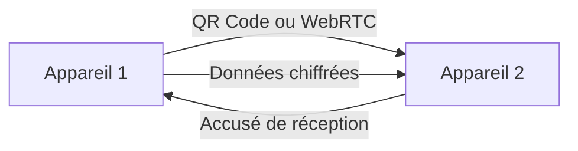
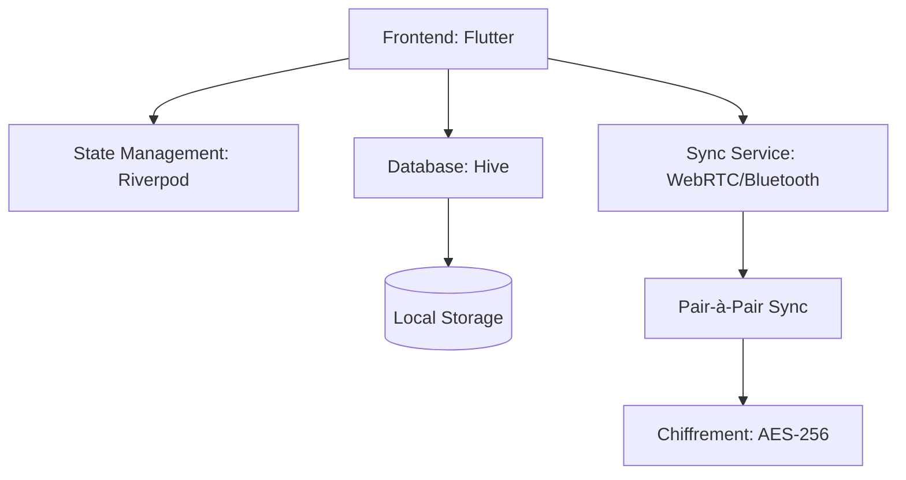

# StatTrack

**Local-first mobile app for tracking sports statistics across multiple profiles.**

---

## What is StatTrack?

StatTrack is a cross-platform mobile application (Android & iOS) that allows users to track sports statistics (goals, assists, matches played) for multiple profiles (children, adults, teams). Designed with simplicity and privacy in mind, all data is stored locally with optional peer-to-peer synchronization.

## Key Features

- **Profile Management**: Track up to 4 players per device
- **Season Organization**: Organize data by sport seasons (e.g., 2026/2027)
- **Match Tracking**: Real-time goal and assist counting with timer
- **Local-First**: 100% of data stored locally using Hive database
- **Peer-to-Peer Sync**: Synchronize data between devices without a central server
- **End-to-End Encryption**: AES-256 encryption for data security
- **Cross-Sport**: Adaptable for football, basketball, handball, and more

## Target Audience

- Parents tracking their children's sports performance
- Amateur athletes
- Coaches managing small groups

## Quick Start

Get started with development:

```bash
# Clone the repository
git clone https://github.com/clercm-pro/football-stat-track.git
cd football-stat-track

# Install dependencies
flutter pub get

# Generate Hive adapters
flutter packages pub run build_runner build

# Run the app
flutter run
```

## Documentation

- [Functional Specifications](docs/FUNCTIONAL-SPECS.md) - User stories, flows, and business rules
- [Technical Architecture](docs/ARCHITECTURE.md) - Stack, structure, and technical decisions
- [Design Guidelines](docs/DESIGN.md) - UI/UX, color palette, and components
- [Data Model](docs/DATA-MODEL.md) - Database schemas and entity relationships
- [Sync Protocol](docs/SYNC-PROTOCOL.md) - Peer-to-peer synchronization implementation
- [Setup & Deployment](docs/SETUP.md) - Development environment and deployment instructions
- [Roadmap](docs/ROADMAP.md) - Project milestones and next steps

## Tech Stack

| Layer | Technology |
|-------|------------|
| Frontend | Flutter (Dart SDK >= 3.0.0) |
| State Management | Riverpod 2.4.9 |
| Database | Hive 2.2.3 (Local NoSQL) |
| Sync | WebRTC + Bluetooth |
| Encryption | AES-256 (cryptography 2.5.0) |

## Project Status

- Prototyping: Complete
- Local Backend: Complete
- Frontend: Complete
- Synchronization: In Progress
- Testing: Pending
- Beta: Pending
- Production Release: Pending

---

**Version**: 1.0.0  
**License**: MIT  
**Maintainer**: [clercm-pro](https://github.com/clercm-pro)

---

---

## **📌 1. CONTEXTE & OBJECTIFS**

### **1.1 Contexte**
Application mobile **cross-platform** (Android & iOS) permettant aux utilisateurs de suivre les statistiques sportives (buts, passes décisives, matchs joués) pour un ou plusieurs profils (enfants, adultes, équipes).

### **1.2 Objectifs Principaux**
- ✅ **Simplicité** : Interface intuitive et minimaliste
- ✅ **Local-first** : 100% des données stockées localement
- ✅ **Synchronisation** : Pair-à-pair sans serveur central (modèle Brave)
- ✅ **Générique** : Adaptable à différents sports (football, basket, handball...)

### **1.3 Public Cible**
- Parents suivant les performances de leurs enfants
- Sportifs amateurs
- Entraîneurs (pour petits groupes)
- **Limite :** 4 profils maximum par appareil

---

---

## **🎨 2. DESIGN & IDENTITÉ VISUELLE**

### **2.1 Palette de Couleurs**
**Source :** [https://colorhunt.co/palette/362f4f5b23ff008bffe4ff30](https://colorhunt.co/palette/362f4f5b23ff008bffe4ff30)

| Couleur | Code Hex | Usage |
|---------|----------|-------|
| **Surface/Background** | `#362F4F` | Arrière-plan principal, cartes |
| **Primaire** | `#5B23FF` | Boutons principaux, AppBar, accents |
| **Secondaire** | `#008BFF` | Bordures, liens, éléments secondaires |
| **Accent** | `#E4FF30` | Icônes, labels, feedbacks |
| **Erreur** | `#EA4335` | Messages d'erreur |
| **Texte Principal** | `#FFFFFF` | Texte sur fond foncé |
| **Texte Secondaire** | `#B0B0B0` | Texte moins important |

### **2.2 Typographie**
| Élément | Police | Taille | Style |
|---------|--------|--------|-------|
| Titres | Roboto | 24sp | Bold |
| Corps de texte | Roboto | 16sp | Regular |
| Boutons | Roboto | 16sp | Medium |
| Labels | Roboto | 14sp | Regular |

### **2.3 Composants UI**
- **Cartes** : `elevation: 4`, `borderRadius: 12`, couleur `#362F4F`
- **Boutons** : Hauteur 48dp, `borderRadius: 8`
- **Champs de saisie** : Bordure `#008BFF`, fond `#362F4F` (80% opacité)
- **Icônes** : Couleur `#E4FF30`

### **2.4 Maquettes (Wireframes)**
*(Voir section 5. Flows Utilisateurs pour les schémas ASCII)*

---

---

## **👥 3. SPÉCIFICATIONS FONCTIONNELLES**

### **3.1 User Stories (US)**

| **ID** | **Titre** | **Description** | **Priorité** | **Critères d'Acceptation** |
|--------|-----------|-----------------|--------------|---------------------------|
| **US-01** | Afficher la liste des profils | En tant qu'utilisateur, je veux voir tous mes profils sur la page d'accueil pour accéder rapidement à leurs statistiques. | ⭐⭐⭐ | - Max 4 profils affichés <br> - Chaque profil affiche : surnom, matchs joués, buts + passes <br> - Bouton **+** visible pour ajouter |
| **US-02** | Créer un profil | En tant qu'utilisateur, je veux ajouter un nouveau profil pour suivre ses performances. | ⭐⭐⭐ | - Champ **surnom** obligatoire <br> - Champs optionnels : prénom, nom, année de naissance <br> - Boutons **Sauvegarder** (redirige vers profil) et **Annuler** (retour accueil) |
| **US-03** | Supprimer un profil | En tant qu'utilisateur, je veux supprimer un profil pour nettoyer l'application. | ⭐⭐ | - Appui long sur un profil → popup de confirmation <br> - Suppression locale + désinscription de la sync <br> - Impossible de supprimer le dernier profil |
| **US-04** | Créer une saison | En tant qu'utilisateur, je veux créer une saison pour organiser les données par période. | ⭐⭐⭐ | - Sélection de 2025/2026 à l'année en cours <br> - Format : `YYYY/YYYY+1` (ex: 2026/2027) <br> - Boutons **Sauvegarder** et **Annuler** |
| **US-05** | Voir les stats d'un profil | En tant qu'utilisateur, je veux consulter les statistiques d'un profil pour une saison donnée. | ⭐⭐⭐ | - Affichage : surnom (gros) + âge (si année de naissance) <br> - Stats : matchs joués, buts, passes décisives <br> - Liste déroulante des saisons |
| **US-06** | Démarrer un match | En tant qu'utilisateur, je veux démarrer un match pour un profil afin d'enregistrer ses actions. | ⭐⭐⭐ | - Bouton visible sur la page profil <br> - Minuteur démarré automatiquement <br> - Alerte si saison non courante |
| **US-07** | Enregistrer buts/passes | En tant qu'utilisateur, je veux enregistrer les buts et passes décisives pendant un match. | ⭐⭐⭐ | - 2 gros boutons : **But** et **Passe décisive** <br> - Compteur visible (ex: `0` → `1`) <br> - **Appui court** = **+1** <br> - **Appui long** = **-1** (min = 0) <br> - Feedback visuel + haptique |
| **US-08** | Terminer un match | En tant qu'utilisateur, je veux terminer un match pour sauvegarder les données. | ⭐⭐⭐ | - Boutons : **Terminer le match** (sauvegarde) / **Annuler** (rien) <br> - Données sauvegardées : durée, buts, passes <br> - Retour automatique à la page profil |
| **US-09** | Naviguer dans l'app | En tant qu'utilisateur, je veux naviguer intuitivement entre les pages. | ⭐⭐ | - Bouton **⌂** (maison) sur la page profil → retour à l'accueil <br> - Bouton **+** sur l'accueil → menu déroulant |
| **US-10** | Synchroniser les données | En tant qu'utilisateur, je veux synchroniser les données entre plusieurs appareils sans serveur central. | ⭐⭐⭐ | - Sync **pair-à-pair** (WebRTC/Bluetooth) <br> - Chiffrement **AES-256** des données <br> - Désinscription automatique d'un profil supprimé |

---

### **3.2 Flows Utilisateurs**

#### **Flow Principal : Accueil → Profil → Match**


#### **Flow de Synchronisation**


#### **Flow d'Erreur : Saison Non Courante**
```mermaid
flowchart TD
    B[Page Profil] -->|Sélection saison ancienne| C[Démarrer Match]
    C -->|Clic| D[Alerte: "Saison non courante?"]
    D -->|Oui| F[Page Match]
    D -->|Non| B
```

---
---
### **3.3 Schémas d'Écrans (Wireframes)**

#### **1. Page d'Accueil**
```
┌─────────────────────────────────────┐
│  STATTRACK                    [+]   │  ← AppBar (couleur #5B23FF)
├─────────────────────────────────────┤
│  ┌─────────────┐  ┌─────────────┐   │
│  │ [Avatar]    │  │ [Avatar]    │   │  ← Grille 2 colonnes
│  │ Leo         │  │ Max         │   │
│  │ 🏆 12 matchs│  │ 🏆 8 matchs │   │
│  │ ⚽ 24 | 🅿️ 10 │  │ ⚽ 15 | 🅿️ 5 │   │  ← Stats par profil
│  └─────────────┘  └─────────────┘   │  ← Card (couleur #362F4F)
│  ┌─────────────┐  ┌─────────────┐   │
│  │ Emma        │  │ [+ Ajouter]  │   │
│  │ 🏆 5 matchs │  │             │   │
│  │ ⚽ 8 | 🅿️ 3  │  │             │   │
│  └─────────────┘  └─────────────┘   │
└─────────────────────────────────────┘
```

#### **2. Page du Profil**
```
┌─────────────────────────────────────┐
│  ←  LEO                      ⌂     │  ← AppBar avec bouton maison
├─────────────────────────────────────┤
│  ┌─────────────────────────────────┐│
│  │  👤 Leo                      10 ans│  ← Surnom + âge
│  └─────────────────────────────────┘│
│  ┌─────────────────────────────────┐│
│  │ Saison: 2026/2027 ▼             │  ← Sélecteur de saison
│  ├─────────────────────────────────┤│
│  │ 🏆 12 | ⚽ 24 | 🅿️ 10             │  ← Stats de la saison
│  └─────────────────────────────────┘│
│  ┌─────────────────────────────────┐│
│  │   [ DÉMARRER UN MATCH ]          │  ← Bouton principal (#5B23FF)
│  └─────────────────────────────────┘│
└─────────────────────────────────────┘
```

#### **3. Page Match en Cours**
```
┌─────────────────────────────────────┐
│  ←  MATCH EN COURS          [⏹️]    │  ← Bouton stop (#5B23FF)
├─────────────────────────────────────┤
│  ⏱️  00:12:34                      │  ← Minuteur (couleur #E4FF30)
│                                     │
│  ┌─────────────┐  ┌─────────────┐   │
│  │    ⚽ 3     │  │    🅿️ 1    │   │  ← Compteurs
│  │   [BUT]    │  │ [PASS DÉC.] │   │  ← Boutons (bordure #E4FF30 et #008BFF)
│  └─────────────┘  └─────────────┘   │
│                                     │
│  ┌─────────────────────────────────┐│
│  │ [TERMINER]          [ANNULER]    │  ← Boutons d'action
│  └─────────────────────────────────┘│
│  Appui court = +1 • Appui long = -1   │  ← Instructions
└─────────────────────────────────────┘
```

---
---
### **3.4 Règles Métier**

| **Règle** | **Description** |
|-----------|-----------------|
| **R-01** | Maximum **4 profils** par appareil |
| **R-02** | Une **saison** = 2 années (ex: 2026/2027) |
| **R-03** | Une saison va de **septembre à juin** |
| **R-04** | **Surnom** obligatoire pour créer un profil |
| **R-05** | **Âge** calculé automatiquement si année de naissance renseignée |
| **R-06** | **Compteurs** : minimum = 0 (ne peut pas descendre en dessous) |
| **R-07** | **Match en cours** : un seul match peut être en cours par profil |
| **R-08** | **Suppression** : confirmation obligatoire avant suppression |
| **R-09** | **Saison par défaut** : saison la plus récente sélectionnée automatiquement |
| **R-10** | **Alerte saison** : confirmation si démarrage de match sur une saison non courante |

---

---
---
## **⚙️ 4. SPÉCIFICATIONS TECHNIQUES**

### **4.1 Architecture Globale**


### **4.2 Stack Technique**

| **Couche** | **Technologie** | **Version** | **Rôle** |
|------------|-----------------|-------------|----------|
| **Frontend** | Flutter (Dart) | SDK ≥ 3.0.0 | UI Cross-platform |
| **State Management** | Riverpod | ^2.4.9 | Gestion d'état réactive |
| **Database** | Hive | ^2.2.3 | Stockage local NoSQL |
| **Sync** | WebRTC | ^0.9.38 | Synchronisation pair-à-pair |
| **QR Code** | qr_flutter | ^4.1.0 | Génération/lecture de QR codes |
| **Chiffrement** | cryptography | ^2.5.0 | Sécurité des données |
| **Vibration** | vibration | ^3.0.0 | Feedback haptique |
| **UUID** | uuid | ^3.0.7 | Génération d'identifiants |

### **4.3 Structure du Projet**
```
football-stat-track/
├── lib/
│   ├── main.dart                 # Point d'entrée
│   ├── app.dart                  # Configuration du thème
│   ├── config/
│   │   └── colors.dart           # Palette de couleurs
│   ├── models/
│   │   ├── child_profile.dart    # Modèle Profil
│   │   ├── season.dart           # Modèle Saison
│   │   └── match.dart            # Modèle Match + Stats
│   ├── providers/
│   │   ├── child_profile_provider.dart
│   │   ├── season_provider.dart
│   │   └── match_provider.dart
│   ├── screens/
│   │   ├── home_screen.dart
│   │   ├── profile_screen.dart
│   │   ├── match_screen.dart
│   │   ├── create_profile_screen.dart
│   │   └── create_season_screen.dart
│   └── widgets/
│       ├── profile_card.dart
│       └── stat_card.dart
├── pubspec.yaml              # Dépendances
├── build.yaml                # Configuration Hive
├── android/
│   └── app/src/main/AndroidManifest.xml
├── ios/
│   └── Runner/Info.plist
└── README.md
```

### **4.4 Modèle de Données**

#### **ChildProfile**
| **Champ** | **Type** | **Description** | **Obligatoire** |
|----------|----------|-----------------|------------------|
| id | String (UUID) | Identifiant unique | ✅ |
| nickname | String | Surnom du profil | ✅ |
| firstName | String? | Prénom | ❌ |
| lastName | String? | Nom de famille | ❌ |
| birthYear | int? | Année de naissance | ❌ |
| createdAt | DateTime | Date de création | ✅ (auto) |
| updatedAt | DateTime | Date de mise à jour | ✅ (auto) |

#### **Season**
| **Champ** | **Type** | **Description** | **Obligatoire** |
|----------|----------|-----------------|------------------|
| id | String (UUID) | Identifiant unique | ✅ |
| name | String | Nom de la saison (ex: "2026/2027") | ✅ |
| startYear | int | Année de début | ✅ |
| endYear | int | Année de fin | ✅ |
| createdAt | DateTime | Date de création | ✅ (auto) |

#### **Match**
| **Champ** | **Type** | **Description** | **Obligatoire** |
|----------|----------|-----------------|------------------|
| id | String (UUID) | Identifiant unique | ✅ |
| childId | String | Référence au profil | ✅ |
| seasonId | String | Référence à la saison | ✅ |
| startTime | DateTime | Heure de début du match | ✅ |
| endTime | DateTime? | Heure de fin du match | ❌ |
| goals | int | Nombre de buts | ✅ (défaut: 0) |
| assists | int | Nombre de passes décisives | ✅ (défaut: 0) |
| duration | Duration? | Durée du match | ❌ (calculée) |
| createdAt | DateTime | Date de création | ✅ (auto) |
| updatedAt | DateTime | Date de mise à jour | ✅ (auto) |

#### **Stats** (calculée)
| **Champ** | **Type** | **Description** |
|----------|----------|-----------------|
| totalMatches | int | Nombre total de matchs |
| totalGoals | int | Nombre total de buts |
| totalAssists | int | Nombre total de passes |

---
---
### **4.5 Synchronisation Pair-à-Pair**

#### **Protocole**
1. **Découverte** : Via mDNS (Bonjour) ou QR Code
2. **Authentification** : Échange de clés publiques
3. **Échange de données** : Envoi des modifications depuis le dernier sync
4. **Résolution de conflits** : Dernière modification gagne (timestamp)
5. **Accusé de réception** : Confirmation de la sync

#### **Format des Données**
```json
{
  "chainId": "550e8400-e29b-41d4-a716-446655440000",
  "deviceId": "device_123",
  "timestamp": "2026-08-23T12:00:00Z",
  "changes": [
    {
      "type": "CREATE|UPDATE|DELETE",
      "entity": "ChildProfile|Season|Match",
      "data": { ... }
    }
  ]
}
```

#### **Chiffrement**
- **Algorithme** : AES-256
- **Clé** : Générée localement par appareil
- **Échange de clés** : Via QR Code ou WebRTC

---
---
### **4.6 Configuration Requise**

#### **Android (`android/app/src/main/AndroidManifest.xml`)**
```xml
<uses-permission android:name="android.permission.INTERNET" />
<uses-permission android:name="android.permission.BLUETOOTH" />
<uses-permission android:name="android.permission.BLUETOOTH_ADMIN" />
<uses-permission android:name="android.permission.ACCESS_FINE_LOCATION" />
<uses-permission android:name="android.permission.CAMERA" />
<uses-permission android:name="android.permission.VIBRATE" />
```

#### **iOS (`ios/Runner/Info.plist`)**
```xml
<key>NSBluetoothAlwaysUsageDescription</key>
<string>StatTrack a besoin du Bluetooth pour synchroniser les données.</string>
<key>NSCameraUsageDescription</key>
<string>StatTrack a besoin de la caméra pour scanner les QR codes.</string>
<key>NSLocalNetworkUsageDescription</key>
<string>StatTrack a besoin du réseau local pour synchroniser les données.</string>
```

---
---
## **🛡️ 5. CONTRAINTES DE SÉCURITÉ**

| **Risque** | **Mesure** | **Implémentation** |
|------------|------------|-------------------|
| **Accès non autorisé** | Chiffrement local | AES-256 pour les données |
| **Fuite de données** | Pas de serveur central | Sync pair-à-pair uniquement |
| **Modification malveillante** | Signature des messages | Clé privée/ publique par appareil |
| **Perte de données** | Sauvegardes locales | Stockage Hive + sync automatique |
| **Usurpation d'identité** | Clé publique/privée | Génération locale |
| **Attaque par replay** | Timestamp + nonce | Rejeter les messages anciens |

---
---
## **🎨 6. CONTRAINTES DE DESIGN (UI/UX)**

### **6.1 Charte Graphique**
| **Élément** | **Spécification** |
|-------------|-------------------|
| **Couleurs** | Primaire: `#5B23FF`, Secondaire: `#008BFF`, Surface: `#362F4F`, Accent: `#E4FF30` |
| **Typographie** | Roboto (Bold 24sp, Regular 16sp, Medium 14sp) |
| **Espacement** | Marges: 16dp, Padding: 8-16dp |
| **Boutons** | Hauteur: 48dp, Bordure: 8dp, Ombre: elevation=4dp |
| **Icônes** | Material Icons, Couleur: `#E4FF30` |

### **6.2 Accessibilité**
| **Exigence** | **Solution** |
|--------------|--------------|
| **Daltonisme** | Couleurs contrastées (WCAG 4.5:1) |
| **Taille des cibles** | Boutons ≥ 48x48dp |
| **Feedback tactile** | Vibration légère (30ms) |
| **Mode sombre** | Support natif (thème sombre par défaut) |
| **Texte lisible** | Taille minimale: 16sp |

### **6.3 Bonnes Pratiques UX**
- **Minimalisme** : 1 action principale par écran
- **Feedback immédiat** : Animation de +1/-1, son optionnel
- **Prévention des erreurs** : Confirmation avant suppression/annulation
- **Consistance** : Boutons toujours au même endroit

---
---
## **📅 7. ROADMAP & PLANNING**

| **Phase** | **Durée** | **Livrables** | **Priorité** | **Statut** |
|-----------|-----------|---------------|--------------|------------|
| **1. Prototypage** | 2 sem | Maquettes + POC Flutter | ⭐⭐⭐ | ✅ |
| **2. Backend Local** | 3 sem | Modèles + Hive + CRUD | ⭐⭐⭐ | ✅ |
| **3. Frontend** | 4 sem | Tous les écrans + navigation | ⭐⭐⭐ | ✅ |
| **4. Synchronisation** | 3 sem | WebRTC + QR Code + conflits | ⭐⭐⭐ | ⏳ |
| **5. Tests** | 2 sem | Tests unitaires + UI | ⭐⭐ | ⏳ |
| **6. Beta Test** | 2 sem | 10 utilisateurs + feedback | ⭐⭐ | ⏳ |
| **7. Publication** | 1 sem | Stores Android/iOS | ⭐ | ⏳ |

---
---
## **💻 8. CODE FLUTTER (EXTRAITS)**

### **8.1 `pubspec.yaml`**
```yaml
name: football_stat_track
description: Application mobile pour suivre les statistiques sportives
version: 1.0.0+1

environment:
  sdk: '>=3.0.0 <4.0.0'

dependencies:
  flutter:
    sdk: flutter
  flutter_riverpod: ^2.4.9
  riverpod: ^2.4.9
  hive: ^2.2.3
  hive_flutter: ^1.1.0
  uuid: ^3.0.7
  intl: ^0.18.1
  qr_flutter: ^4.1.0
  flutter_webrtc: ^0.9.38
  vibration: ^3.0.0
  shared_preferences: ^2.2.2
  cryptography: ^2.5.0
  encrypt: ^5.0.1
  cupertino_icons: ^1.0.2

dev_dependencies:
  flutter_test:
    sdk: flutter
  hive_generator: ^2.0.1
  build_runner: ^2.4.6

flutter:
  uses-material-design: true
```

### **8.2 `lib/main.dart`**
```dart
import 'package:flutter/material.dart';
import 'package:flutter_riverpod/flutter_riverpod.dart';
import 'package:hive_flutter/hive_flutter.dart';
import 'app.dart';
import 'models/child_profile.dart';
import 'models/season.dart';
import 'models/match.dart';

void main() async {
  WidgetsFlutterBinding.ensureInitialized();

  await Hive.initFlutter();

  Hive.registerAdapter(ChildProfileAdapter());
  Hive.registerAdapter(SeasonAdapter());
  Hive.registerAdapter(MatchAdapter());

  await Hive.openBox<ChildProfile>('child_profiles');
  await Hive.openBox<Season>('seasons');
  await Hive.openBox<Match>('matches');

  runApp(
    const ProviderScope(
      child: StatTrackApp(),
    ),
  );
}
```

### **8.3 `lib/app.dart`**
```dart
import 'package:flutter/material.dart';
import 'screens/home_screen.dart';
import 'config/colors.dart';

class StatTrackApp extends StatelessWidget {
  const StatTrackApp({super.key});

  @override
  Widget build(BuildContext context) {
    return MaterialApp(
      title: 'StatTrack',
      theme: AppColors.themeData,
      darkTheme: ThemeData.dark(),
      themeMode: ThemeMode.dark,
      home: const HomeScreen(),
      debugShowCheckedModeBanner: false,
    );
  }
}
```

### **8.4 `lib/config/colors.dart`**
```dart
import 'package:flutter/material.dart';

class AppColors {
  static const primary = Color(0xFF5B23FF);
  static const secondary = Color(0xFF008BFF);
  static const surface = Color(0xFF362F4F);
  static const accent = Color(0xFFE4FF30);
  static const error = Color(0xFFEA4335);
  static const textPrimary = Colors.white;
  static const textSecondary = Color(0xFFB0B0B0);

  static ThemeData get themeData => ThemeData(
    colorScheme: const ColorScheme(
      primary: primary,
      secondary: secondary,
      surface: surface,
      background: surface,
      error: error,
      onPrimary: textPrimary,
      onSecondary: textPrimary,
      onSurface: textPrimary,
      onBackground: textPrimary,
      onError: textPrimary,
      brightness: Brightness.dark,
    ),
    useMaterial3: true,
    fontFamily: 'Roboto',
    appBarTheme: const AppBarTheme(
      centerTitle: true,
      elevation: 4,
    ),
    cardTheme: CardTheme(
      elevation: 4,
      margin: const EdgeInsets.all(8),
      shape: RoundedRectangleBorder(
        borderRadius: BorderRadius.circular(12),
      ),
      color: surface,
    ),
    elevatedButtonTheme: ElevatedButtonThemeData(
      style: ElevatedButton.styleFrom(
        backgroundColor: primary,
        foregroundColor: textPrimary,
        padding: const EdgeInsets.symmetric(horizontal: 24, vertical: 12),
        shape: RoundedRectangleBorder(
          borderRadius: BorderRadius.circular(8),
        ),
      ),
    ),
    outlinedButtonTheme: OutlinedButtonThemeData(
      style: OutlinedButton.styleFrom(
        foregroundColor: secondary,
        padding: const EdgeInsets.symmetric(horizontal: 24, vertical: 12),
        shape: RoundedRectangleBorder(
          borderRadius: BorderRadius.circular(8),
        ),
        side: const BorderSide(color: secondary, width: 2),
      ),
    ),
    inputDecorationTheme: InputDecorationTheme(
      filled: true,
      fillColor: surface.withOpacity(0.8),
      border: OutlineInputBorder(
        borderRadius: BorderRadius.circular(12),
        borderSide: const BorderSide(color: secondary),
      ),
      enabledBorder: OutlineInputBorder(
        borderRadius: BorderRadius.circular(12),
        borderSide: const BorderSide(color: secondary),
      ),
      focusedBorder: OutlineInputBorder(
        borderRadius: BorderRadius.circular(12),
        borderSide: const BorderSide(color: primary, width: 2),
      ),
      labelStyle: const TextStyle(color: accent),
      hintStyle: const TextStyle(color: textSecondary),
    ),
    iconTheme: const IconThemeData(color: accent),
  );
}
```

---
---
## **🚀 9. INSTRUCTIONS DE DÉPLOIEMENT**

### **9.1 Prérequis**
- [Flutter SDK](https://flutter.dev/docs/get-started/install) (≥ 3.0.0)
- Android Studio / Xcode
- Git
- Appareil Android (API 24+) ou iOS (iOS 13+)

### **9.2 Étapes d'Installation**
```bash
# 1. Créer un nouveau projet
flutter create football_stat_track
cd football_stat_track

# 2. Remplacer les fichiers par ceux de ce document

# 3. Installer les dépendances
flutter pub get

# 4. Générer les adapteurs Hive (OBLIGATOIRE)
flutter packages pub run build_runner build

# 5. Lancer l'application
flutter run
```

### **9.3 Commandes Utiles**
```bash
# Build Android
flutter build apk --release
flutter build appbundle --release

# Build iOS
flutter build ipa --release

# Lancer sur émulateur
flutter emulators --launch <emulator_name>
flutter run

# Nettoyer le cache
flutter clean
```

### **9.4 Déploiement sur GitHub**
```bash
# Initialiser git
git init

# Ajouter tous les fichiers
git add .

# Commiter
git commit -m "Initial commit: StatTrack with complete specifications"

# Ajouter le remote (remplacez par votre URL)
git remote add origin https://github.com/clercm-pro/football-stat-track.git

# Pousser
git branch -M main
git push -u origin main
```

---
---
## **📌 10. ANNEXES**

### **10.1 Glossaire**
| **Terme** | **Définition** |
|-----------|----------------|
| **Profil** | Entité représentant un joueur (enfant ou adulte) |
| **Saison** | Période de 2 années (ex: 2026/2027) |
| **Match** | Session de jeu avec minuteur, buts et passes |
| **Sync Pair-à-Pair** | Synchronisation directe entre appareils sans serveur |
| **Hive** | Base de données NoSQL locale pour Flutter |

### **10.2 Références**
- [Flutter Documentation](https://flutter.dev/docs)
- [Riverpod Documentation](https://riverpod.dev/)
- [Hive Documentation](https://docs.hivedb.dev/)
- [WebRTC Flutter](https://pub.dev/packages/flutter_webrtc)
- [Palette de Couleurs](https://colorhunt.co/palette/362f4f5b23ff008bffe4ff30)

### **10.3 Historique des Versions**
| **Version** | **Date** | **Auteur** | **Modifications** |
|-------------|----------|------------|-------------------|
| 1.0 | 23/08/2026 | Assistant IA | Version initiale |

---
---
## **🎯 11. PROCHAINES ÉTAPES**

### **À Court Terme (1-2 semaines)**
- [ ] Finaliser le prototype Flutter
- [ ] Tester sur émulateurs Android/iOS
- [ ] Corriger les bugs identifiés

### **À Moyen Terme (1 mois)**
- [ ] Implémenter la synchronisation pair-à-pair
- [ ] Ajouter le chiffrement des données
- [ ] Tester la sync entre 2 appareils physiques

### **À Long Terme (2-3 mois)**
- [ ] Publier sur Play Store
- [ ] Publier sur App Store
- [ ] Ajouter des fonctionnalités avancées (export/import, backup cloud optionnel)

---
---
## **✅ RÉSUMÉ**

Ce document contient **toutes les spécifications fonctionnelles** pour l'application **StatTrack** :
- ✅ **Design** : Palette de couleurs complète + charte graphique
- ✅ **Fonctionnalités** : 10 User Stories + règles métier
- ✅ **Technique** : Stack Flutter + Hive + Riverpod
- ✅ **Code** : Extraits des fichiers principaux
- ✅ **Instructions** : Déploiement complet

**L'application est prête à être développée !** 🚀

---
---
**Document généré le 23/08/2026**
*Pour toute question, consulter la documentation officielle ou ouvrir une issue sur GitHub.*
