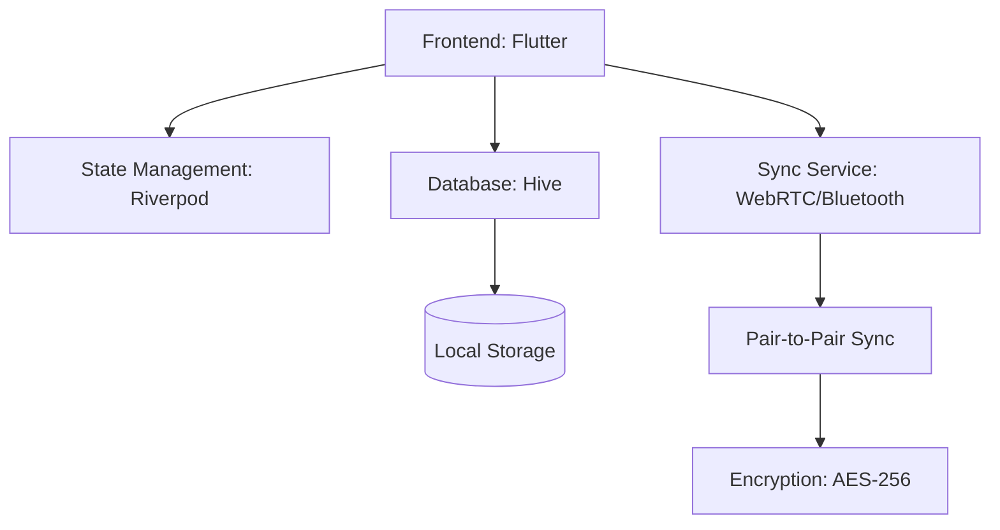

# Technical Architecture

This document describes the technical architecture, technology stack, and project structure for StatTrack.

---

## Architecture Overview



## Technology Stack

| Layer | Technology | Version | Purpose |
|-------|------------|---------|---------|
| **Frontend** | Flutter (Dart) | SDK >= 3.0.0 | Cross-platform UI |
| **State Management** | Riverpod | ^2.4.9 | Reactive state management |
| **Database** | Hive | ^2.2.3 | Local NoSQL storage |
| **Sync** | WebRTC | ^0.9.38 | Peer-to-peer synchronization |
| **QR Code** | qr_flutter | ^4.1.0 | QR code generation/reading |
| **Encryption** | cryptography | ^2.5.0 | Data security |
| **Vibration** | vibration | ^3.0.0 | Haptic feedback |
| **UUID** | uuid | ^3.0.7 | ID generation |

## Project Structure

```
football-stat-track/
├── lib/
│   ├── main.dart                 # Entry point
│   ├── app.dart                  # Theme configuration
│   ├── config/
│   │   └── colors.dart           # Color palette
│   ├── models/
│   │   ├── child_profile.dart    # Profile model
│   │   ├── season.dart           # Season model
│   │   └── match.dart            # Match + Stats model
│   ├── providers/
│   │   ├── child_profile_provider.dart
│   │   ├── season_provider.dart
│   │   └── match_provider.dart
│   ├── screens/
│   │   ├── home_screen.dart
│   │   ├── profile_screen.dart
│   │   ├── match_screen.dart
│   │   ├── create_profile_screen.dart
│   │   └── create_season_screen.dart
│   └── widgets/
│       ├── profile_card.dart
│       └── stat_card.dart
├── pubspec.yaml              # Dependencies
├── build.yaml                # Hive configuration
├── android/
│   └── app/src/main/AndroidManifest.xml
├── ios/
│   └── Runner/Info.plist
└── README.md
```

## Key Technical Decisions

### Local-First Approach

All data is stored locally using Hive, a lightweight NoSQL database for Flutter. This ensures:
- Offline functionality
- Fast access to data
- No dependency on external servers
- Full user control over their data

### Peer-to-Peer Synchronization

Data synchronization happens directly between devices using WebRTC and Bluetooth, without a central server. This provides:
- True privacy - no third-party access to data
- Offline sync capability
- Lower infrastructure costs
- Faster synchronization for nearby devices

### End-to-End Encryption

All data is encrypted using AES-256 before transmission. Keys are exchanged via QR codes or WebRTC connection, ensuring:
- Confidentiality of user data
- Protection against interception
- Secure data at rest and in transit

---

**See also:**
- [Data Model](DATA-MODEL.md) for entity definitions
- [Sync Protocol](SYNC-PROTOCOL.md) for synchronization details
- [Setup Guide](SETUP.md) for development environment configuration
