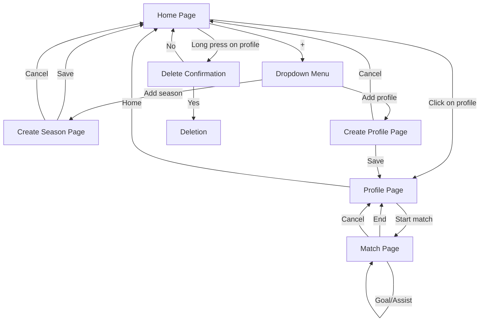
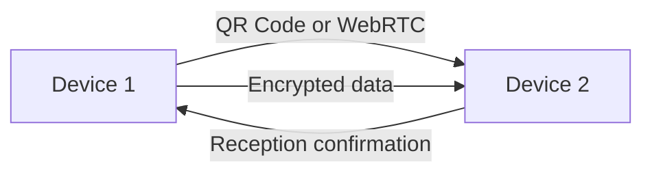

# Functional Specifications

This document outlines the functional requirements for StatTrack, including user stories, user flows, wireframes, and business rules.

---

## User Stories

| ID | Title | Description | Priority | Acceptance Criteria |
|----|-------|-------------|----------|---------------------|
| **US-01** | Display profile list | As a user, I want to see all my profiles on the home page to quickly access their statistics | High | - Max 4 profiles displayed <br> - Each profile shows: nickname, matches played, goals + assists <br> - **+** button visible for adding |
| **US-02** | Create a profile | As a user, I want to add a new profile to track their performance | High | - **nickname** field required <br> - Optional fields: first name, last name, birth year <br> - **Save** button (redirects to profile) and **Cancel** button (returns to home) |
| **US-03** | Delete a profile | As a user, I want to delete a profile to clean up the application | Medium | - Long press on profile → confirmation popup <br> - Local deletion + unsubscribe from sync <br> - Cannot delete the last profile |
| **US-04** | Create a season | As a user, I want to create a season to organize data by period | High | - Selection from 2025/2026 to current year <br> - Format: `YYYY/YYYY+1` (e.g., 2026/2027) <br> - **Save** and **Cancel** buttons |
| **US-05** | View profile stats | As a user, I want to view a profile's statistics for a given season | High | - Display: nickname (large) + age (if birth year provided) <br> - Stats: matches played, goals, assists <br> - Season dropdown list |
| **US-06** | Start a match | As a user, I want to start a match for a profile to record actions | High | - Button visible on profile page <br> - Timer started automatically <br> - Alert if non-current season |
| **US-07** | Record goals/assists | As a user, I want to record goals and assists during a match | High | - 2 large buttons: **Goal** and **Assist** <br> - Visible counter (e.g., `0` → `1`) <br> - **Short press** = **+1** <br> - **Long press** = **-1** (min = 0) <br> - Visual + haptic feedback |
| **US-08** | End a match | As a user, I want to end a match to save the data | High | - Buttons: **End match** (save) / **Cancel** (nothing) <br> - Saved data: duration, goals, assists <br> - Automatic return to profile page |
| **US-09** | Navigate the app | As a user, I want to navigate intuitively between pages | Medium | - **Home** button on profile page → returns to home <br> - **+** button on home → dropdown menu |
| **US-10** | Sync data | As a user, I want to synchronize data between multiple devices without a central server | High | - Peer-to-peer sync (WebRTC/Bluetooth) <br> - **AES-256** encryption of data <br> - Automatic unsubscribe of deleted profile |

---

## User Flows

### Main Flow: Home → Profile → Match



### Sync Flow



### Error Flow: Non-Current Season

```mermaid
flowchart TD
    B[Profile Page] -->|Select old season| C[Start Match]
    C -->|Click| D[Alert: "Non-current season?"]
    D -->|Yes| F[Match Page]
    D -->|No| B
```

---

## Wireframes

### 1. Home Page

```
┌─────────────────────────────────────┐
│  STATTRACK                    [+]   │  ← AppBar (color #5B23FF)
├─────────────────────────────────────┤
│  ┌─────────────┐  ┌─────────────┐   │
│  │ [Avatar]    │  │ [Avatar]    │   │  ← 2-column grid
│  │ Leo         │  │ Max         │   │
│  │ 🏆 12 matches│  │ 🏆 8 matches │   │
│  │ ⚽ 24 | 🅿️ 10 │  │ ⚽ 15 | 🅿️ 5 │   │  ← Stats per profile
│  └─────────────┘  └─────────────┘   │  ← Card (color #362F4F)
│  ┌─────────────┐  ┌─────────────┐   │
│  │ Emma        │  │ [+ Add]     │   │
│  │ 🏆 5 matches│  │             │   │
│  │ ⚽ 8 | 🅿️ 3  │  │             │   │
│  └─────────────┘  └─────────────┘   │
└─────────────────────────────────────┘
```

### 2. Profile Page

```
┌─────────────────────────────────────┐
│  ←  LEO                      Home    │  ← AppBar with home button
├─────────────────────────────────────┤
│  ┌─────────────────────────────────┐│
│  │  👤 Leo                      10 yo│  ← Nickname + age
│  └─────────────────────────────────┘│
│  ┌─────────────────────────────────┐│
│  │ Season: 2026/2027 ▼             │  ← Season selector
├─────────────────────────────────┤│
│  │ 🏆 12 | ⚽ 24 | 🅿️ 10             │  ← Season stats
│  └─────────────────────────────────┘│
│  ┌─────────────────────────────────┐│
│  │   [ START A MATCH ]             │  ← Primary button (#5B23FF)
│  └─────────────────────────────────┘│
└─────────────────────────────────────┘
```

### 3. Match In Progress Page

```
┌─────────────────────────────────────┐
│  ←  MATCH IN PROGRESS          [⏹️] │  ← Stop button (#5B23FF)
├─────────────────────────────────────┤
│  ⏱️  00:12:34                      │  ← Timer (color #E4FF30)
│                                     │
│  ┌─────────────┐  ┌─────────────┐   │
│  │    ⚽ 3     │  │    🅿️ 1    │   │  ← Counters
│  │   [GOAL]    │  │ [ASSIST]    │   │  ← Buttons (border #E4FF30 and #008BFF)
│  └─────────────┘  └─────────────┘   │
│                                     │
│  ┌─────────────────────────────────┐│
│  │ [END]          [CANCEL]        │  ← Action buttons
│  └─────────────────────────────────┘│
│  Short press = +1 • Long press = -1 │  ← Instructions
└─────────────────────────────────────┘
```

---

## Business Rules

| Rule | Description |
|------|-------------|
| **R-01** | Maximum **4 profiles** per device |
| **R-02** | A **season** = 2 years (e.g., 2026/2027) |
| **R-03** | A season runs from **September to June** |
| **R-04** | **Nickname** required to create a profile |
| **R-05** | **Age** calculated automatically if birth year provided |
| **R-06** | **Counters**: minimum = 0 (cannot go below) |
| **R-07** | **Match in progress**: only one match can be in progress per profile |
| **R-08** | **Deletion**: confirmation required before deletion |
| **R-09** | **Default season**: most recent season selected automatically |
| **R-10** | **Season alert**: confirmation if starting match on a non-current season |

---

**See also:**
- [Design Guidelines](DESIGN.md) for UI/UX specifications
- [Data Model](DATA-MODEL.md) for entity definitions
