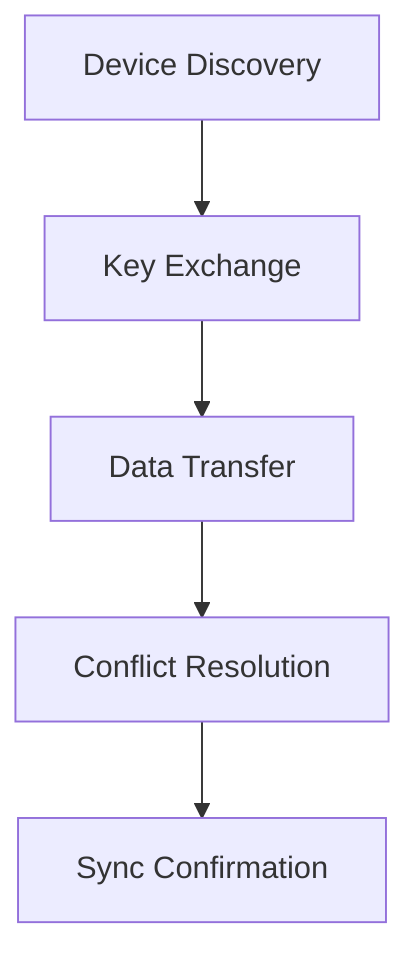

# Sync Protocol

This document describes the peer-to-peer synchronization protocol for StatTrack, including discovery, authentication, data exchange, and conflict resolution.

---

## Overview

StatTrack uses a **local-first** approach with **peer-to-peer synchronization**. Data is synchronized directly between devices without a central server, ensuring user privacy and offline capability.

---

## Protocol Steps

1. **Discovery**: Devices find each other via mDNS (Bonjour) or QR Code
2. **Authentication**: Exchange of public keys
3. **Data Exchange**: Send changes since last sync
4. **Conflict Resolution**: Last modification wins (timestamp-based)
5. **Acknowledgment**: Confirmation of successful sync



---

## Discovery

Devices can discover each other using:

### Method 1: mDNS (Bonjour)
- Automatic discovery on local network
- Works when devices are on the same Wi-Fi network
- No manual intervention required

### Method 2: QR Code
- Manual pairing via QR code scanning
- Works for devices on different networks
- Requires camera access

---

## Authentication

### Key Exchange
- Each device generates a local **AES-256 key pair**
- Public keys are exchanged during discovery
- QR codes contain public key and device identifier

### Security Properties
- **No central authority**: Keys are generated and managed locally
- **End-to-end encryption**: Data is encrypted before transmission
- **Forward secrecy**: Each sync session can use ephemeral keys

---

## Data Format

### Sync Message Structure

```json
{
  "chainId": "550e8400-e29b-41d4-a716-446655440000",
  "deviceId": "device_123",
  "timestamp": "2026-08-23T12:00:00Z",
  "changes": [
    {
      "type": "CREATE|UPDATE|DELETE",
      "entity": "ChildProfile|Season|Match",
      "data": { ... }
    }
  ]
}
```

### Field Descriptions

| Field | Type | Description |
|-------|------|-------------|
| `chainId` | String (UUID) | Unique identifier for the sync chain |
| `deviceId` | String | Identifier of the sending device |
| `timestamp` | ISO 8601 | When the sync message was created |
| `changes` | Array | List of data changes to synchronize |

### Change Object

| Field | Type | Description |
|-------|------|-------------|
| `type` | Enum | `CREATE`, `UPDATE`, or `DELETE` |
| `entity` | Enum | `ChildProfile`, `Season`, or `Match` |
| `data` | Object | The entity data (for CREATE/UPDATE) or metadata (for DELETE) |

---

## Encryption

### Algorithm
- **AES-256** symmetric encryption
- Keys are 256-bit (32 bytes)

### Key Management
- **Key Generation**: Each device generates its own AES-256 key locally
- **Key Exchange**: Public keys exchanged via QR code or WebRTC
- **Key Storage**: Keys stored securely in device's secure storage

### Data Protection
- All sync data is encrypted before transmission
- Data is encrypted at rest on each device
- Keys never leave the device

---

## Conflict Resolution

### Strategy: Last Write Wins

When the same entity is modified on both devices:
1. Compare `updatedAt` timestamps
2. The change with the **newer timestamp** wins
3. Older change is discarded

### Example

```
Device A updates Profile X at 12:00:00
Device B updates Profile X at 12:01:00
→ Device B's change wins (newer timestamp)
```

### Edge Cases

| Scenario | Resolution |
|----------|------------|
| Same timestamp | Arbitrary choice (device ID tiebreaker) |
| Deleted on one device | Delete wins over update |
| Created on both devices | Merge if possible, else use newer timestamp |

---

## Error Handling

### Network Errors
- Retry with exponential backoff
- Queue changes for later sync
- Notify user of pending sync

### Authentication Errors
- Re-prompt for QR code scan
- Re-attempt key exchange
- Show clear error message

### Data Validation Errors
- Reject invalid data
- Log error for debugging
- Continue with valid changes

---

## Platform-Specific Configuration

### Android Permissions

Required in `android/app/src/main/AndroidManifest.xml`:

```xml
<uses-permission android:name="android.permission.INTERNET" />
<uses-permission android:name="android.permission.BLUETOOTH" />
<uses-permission android:name="android.permission.BLUETOOTH_ADMIN" />
<uses-permission android:name="android.permission.ACCESS_FINE_LOCATION" />
<uses-permission android:name="android.permission.CAMERA" />
<uses-permission android:name="android.permission.VIBRATE" />
```

### iOS Permissions

Required in `ios/Runner/Info.plist`:

```xml
<key>NSBluetoothAlwaysUsageDescription</key>
<string>StatTrack needs Bluetooth to synchronize data.</string>
<key>NSCameraUsageDescription</key>
<string>StatTrack needs the camera to scan QR codes.</string>
<key>NSLocalNetworkUsageDescription</key>
<string>StatTrack needs local network for synchronizing data.</string>
```

---

## Security Considerations

| Risk | Mitigation | Implementation |
|------|------------|----------------|
| **Unauthorized access** | Local encryption | AES-256 for data at rest |
| **Data leakage** | No central server | Peer-to-peer only |
| **Malicious modification** | Message signing | Public/private key per device |
| **Data loss** | Local backups | Hive storage + auto sync |
| **Identity spoofing** | Public/private keys | Local key generation |
| **Replay attacks** | Timestamp + nonce | Reject old messages |

---

**See also:**
- [Technical Architecture](ARCHITECTURE.md) for overall system design
- [Data Model](DATA-MODEL.md) for entity definitions
- [Functional Specifications](FUNCTIONAL-SPECS.md) for user stories
